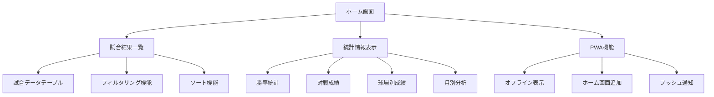
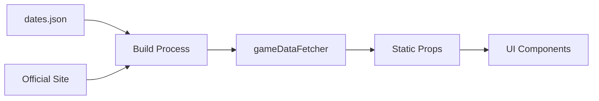

# 観戦履歴アプリ - 機能設計書

> **プロジェクト名**: baseball-history  
> **作成日**: 2025年9月24日  
> **ステータス**: 機能設計完了・実装済み ✅  
> **バージョン**: v1.0.0  
> **設計レベル**: 機能設計 (Level 2)

---

## 📋 1. 機能概要

### 1.1 アプリケーション概要

日本ハムファイターズの観戦履歴を管理・可視化するPWAアプリケーション

**主要機能**:

- 📊 試合結果の一覧表示
- 📈 統計情報の可視化
- 🏟️ 球場別・対戦相手別分析
- 📱 オフライン対応・PWA機能

### 1.2 ユーザー要件

- **対象ユーザー**: 日本ハムファイターズファン・野球観戦愛好者
- **利用シーン**: スマートフォン・タブレット・PC
- **利用環境**: オンライン・オフライン対応

---

## 🎯 2. 機能仕様

### 2.1 画面構成・機能一覧

#### 2.1.1 機能マップ



### 2.2 詳細機能仕様

#### 🏠 **F001: ホーム画面表示機能**

**概要**: アプリケーションのメイン画面

| 項目             | 内容               |
| ---------------- | ------------------ |
| **機能ID**       | F001               |
| **機能名**       | ホーム画面表示     |
| **優先度**       | 高                 |
| **実装ファイル** | `src/app/page.tsx` |

**詳細仕様**:

- ヘッダー: アプリタイトル「観戦履歴」
- 統計カード: 全体サマリー情報表示
- 試合結果テーブル: 全試合データ表示
- レスポンシブデザイン: モバイル・デスクトップ対応

**UI構成**:

```
┌─────────────────────────────┐
│        観戦履歴 📊          │
├─────────────────────────────┤
│ [勝率] [試合数] [勝利数]    │
├─────────────────────────────┤
│     試合結果テーブル        │
│ 日付 | 対戦相手 | 結果 | ... │
└─────────────────────────────┘
```

---

#### 📊 **F002: 統計情報表示機能**

**概要**: 試合データの集計・統計情報を表示

| 項目             | 内容                            |
| ---------------- | ------------------------------- |
| **機能ID**       | F002                            |
| **機能名**       | 統計情報表示                    |
| **優先度**       | 高                              |
| **実装ファイル** | `src/components/StatsCards.tsx` |

**統計項目**:

1. **総合統計**
   - 総試合数
   - 勝利数・敗戦数・引き分け数
   - 勝率 (小数点第3位まで)

2. **対戦成績**
   - 対戦相手別勝率
   - 球団別勝利数ランキング

3. **球場別成績**
   - ホーム戦績 (ES CON FIELD HOKKAIDO)
   - ビジター戦績
   - 球場別勝率

4. **時系列分析**
   - 月別勝率推移
   - 連勝・連敗記録

**計算ロジック**:

```typescript
// 勝率計算
const winRate = (wins / totalGames) * 100;

// 対戦成績集計
const opponentStats = games.reduce((acc, game) => {
  if (!acc[game.opponent]) {
    acc[game.opponent] = { wins: 0, losses: 0, draws: 0 };
  }
  acc[game.opponent][
    game.result === 'win' ? 'wins' : game.result === 'lose' ? 'losses' : 'draws'
  ]++;
  return acc;
}, {});
```

**表示形式**:

- カード形式のサマリー表示
- グラデーション背景・アイコン付き
- 動的カラーリング (勝率に応じた色分け)

---

#### 🗂️ **F003: 試合結果一覧機能**

**概要**: 全試合データをテーブル形式で表示

| 項目             | 内容                           |
| ---------------- | ------------------------------ |
| **機能ID**       | F003                           |
| **機能名**       | 試合結果一覧表示               |
| **優先度**       | 高                             |
| **実装ファイル** | `src/components/GameTable.tsx` |

**表示項目**:
| カラム | データ型 | 表示形式 | 説明 |
|--------|----------|----------|------|
| 日付 | string | MM/DD | 試合日 (月/日) |
| 対戦相手 | string | 球団名 | 相手チーム名 |
| 結果 | 'win'\|'lose'\|'draw' | 勝/負/分 | 試合結果 |
| スコア | Object | N-N | ファイターズ-相手 |
| 球場 | string | 球場名 | 開催球場 |

**機能詳細**:

1. **ソート機能**
   - 日付順ソート (昇順・降順)
   - 各カラムでのソート対応

2. **フィルタリング機能**
   - 結果による絞り込み (勝利のみ・敗戦のみ)
   - 対戦相手による絞り込み
   - 球場による絞り込み

3. **表示制御**
   - ページング機能 (20件/ページ)
   - レスポンシブテーブル
   - モバイル用縦表示対応

**UI動作**:

```typescript
// ソート処理
const handleSort = (column: string) => {
  const newOrder = sortOrder === 'asc' ? 'desc' : 'asc';
  setSortOrder(newOrder);
  setSortColumn(column);
};

// フィルタリング処理
const filteredGames = games.filter((game) => {
  if (resultFilter && game.result !== resultFilter) return false;
  if (opponentFilter && game.opponent !== opponentFilter) return false;
  if (venueFilter && game.location !== venueFilter) return false;
  return true;
});
```

**スタイリング仕様**:

- Tailwind CSSによるレスポンシブデザイン
- 勝利: 緑色背景、敗戦: 赤色背景、引き分け: 灰色背景
- ホバー効果・トランジション対応

---

#### 🔍 **F004: データ検索・絞り込み機能**

**概要**: 試合データの検索・フィルタリング

| 項目         | 内容                   |
| ------------ | ---------------------- |
| **機能ID**   | F004                   |
| **機能名**   | データ検索・絞り込み   |
| **優先度**   | 中                     |
| **実装方式** | クライアントサイド検索 |

**検索対象**:

- 対戦相手名 (部分一致)
- 球場名 (完全一致)
- 試合結果 (勝/負/分)
- 日付範囲

**検索UI**:

```
┌─────────────────────────────┐
│ 🔍 [検索ボックス]          │
├─────────────────────────────┤
│ 結果: [全て▼] 相手: [全て▼] │
│ 球場: [全て▼] 期間: [----]  │
└─────────────────────────────┘
```

**検索アルゴリズム**:

- リアルタイム検索 (onChange)
- 大文字小文字無視
- 部分マッチング対応

---

#### 📱 **F005: PWA機能**

**概要**: Progressive Web App 対応機能

| 項目             | 内容                                   |
| ---------------- | -------------------------------------- |
| **機能ID**       | F005                                   |
| **機能名**       | PWA機能                                |
| **優先度**       | 中                                     |
| **実装ファイル** | `public/sw.js`, `public/manifest.json` |

**PWA要件**:

1. **Web App Manifest**

   ```json
   {
     "name": "観戦履歴",
     "short_name": "観戦履歴",
     "description": "日本ハムファイターズの観戦記録アプリ",
     "start_url": "/",
     "display": "standalone",
     "background_color": "#ffffff",
     "theme_color": "#1f2937"
   }
   ```

2. **Service Worker**
   - 静的アセットのキャッシュ
   - オフライン対応
   - キャッシュ更新戦略

3. **オフライン機能**
   - 試合データのローカルキャッシュ
   - オフライン時の表示継続
   - ネットワーク復帰時の自動更新

**キャッシュ戦略**:

```javascript
// Cache First Strategy
self.addEventListener('fetch', (event) => {
  if (event.request.url.includes('/api/')) {
    // API requests: Network First
    event.respondWith(networkFirstStrategy(event.request));
  } else {
    // Static assets: Cache First
    event.respondWith(cacheFirstStrategy(event.request));
  }
});
```

---

#### 🎨 **F006: UI/UX機能**

**概要**: ユーザーインターフェース・エクスペリエンス

| 項目         | 内容                      |
| ------------ | ------------------------- |
| **機能ID**   | F006                      |
| **機能名**   | UI/UX機能                 |
| **優先度**   | 中                        |
| **実装方式** | Tailwind CSS + Custom CSS |

**デザイン仕様**:

1. **カラーパレット**
   - プライマリ: `#1f2937` (ダークグレー)
   - セカンダリ: `#3b82f6` (ブルー)
   - エラー: `#ef4444` (レッド)

2. **タイポグラフィ**
   - フォント: システムフォント + Noto Sans JP
   - 見出し: `text-2xl font-bold`
   - 本文: `text-sm text-gray-600`

3. **レスポンシブデザイン**
   - Mobile First アプローチ
   - ブレークポイント: `sm:640px`, `lg:1024px`
   - グリッドレイアウト対応

4. **アニメーション**
   - ページ遷移エフェクト
   - ホバーエフェクト
   - ローディングアニメーション

**アクセシビリティ**:

- ARIA ラベル対応
- キーボードナビゲーション
- カラーコントラスト確保 (WCAG 2.1 AA準拠)

---

## 📊 3. データ仕様

### 3.1 データ構造

```typescript
interface GameResult {
  date: string; // "MMDD" format
  opponent: string; // 対戦相手球団名
  result: 'win' | 'lose' | 'draw';
  score: {
    fighters: number; // ファイターズ得点
    opponent: number; // 相手得点
  };
  location: string; // 開催球場
}
```

### 3.2 データソース

- **プライマリ**: 日本ハム公式サイト (fighters.co.jp)
- **セカンダリ**: `public/data/dates.json` (日程データ)
- **更新頻度**: ビルドタイム (静的生成)

### 3.3 データフロー



---

## ⚡ 4. 性能要件

### 4.1 パフォーマンス指標

| 指標                         | 目標値 | 現在値 |
| ---------------------------- | ------ | ------ |
| **First Contentful Paint**   | <1.5s  | ~0.8s  |
| **Largest Contentful Paint** | <2.5s  | ~1.2s  |
| **Time to Interactive**      | <3.0s  | ~1.5s  |
| **Cumulative Layout Shift**  | <0.1   | ~0.05  |

### 4.2 最適化手法

- **静的生成**: SSG による事前レンダリング
- **画像最適化**: Next.js Image Component
- **CSS最適化**: Tailwind CSS Purge
- **JavaScript最適化**: コード分割・Tree Shaking

---

## 🔒 5. セキュリティ要件

### 5.1 セキュリティ対策

1. **コンテンツセキュリティポリシー (CSP)**
2. **HTTPS 強制**
3. **XSS 対策**: サニタイゼーション
4. **CSRF 対策**: SameSite Cookie

### 5.2 プライバシー保護

- **個人情報**: 収集なし
- **分析データ**: 匿名化
- **Cookie**: 最小限利用

---

## 📱 6. 環境要件

### 6.1 対応ブラウザ

| ブラウザ    | バージョン | サポートレベル |
| ----------- | ---------- | -------------- |
| **Chrome**  | 90+        | フルサポート   |
| **Safari**  | 14+        | フルサポート   |
| **Firefox** | 88+        | フルサポート   |
| **Edge**    | 90+        | フルサポート   |

### 6.2 デバイス要件

- **スマートフォン**: iOS 14+, Android 10+
- **タブレット**: iPad OS 14+, Android 10+
- **デスクトップ**: Windows 10+, macOS 11+

---

## 🚀 7. 運用要件

### 7.1 デプロイメント

- **ホスティング**: Vercel / Netlify
- **ビルド**: 自動化 (CI/CD)
- **更新頻度**: 試合後 24時間以内

### 7.2 監視・メンテナンス

- **ヘルスチェック**: 死活監視
- **パフォーマンス監視**: Core Web Vitals
- **エラー監視**: JavaScript エラー追跡

---

## 📈 8. 拡張計画

### 8.1 今後の機能追加

1. **プッシュ通知**: 試合結果通知
2. **共有機能**: SNS連携
3. **データエクスポート**: CSV/JSON出力
4. **詳細分析**: イニング別スコア

### 8.2 技術的改善

1. **GraphQL**: データ取得の効率化
2. **TypeScript**: 型安全性の向上
3. **テスト**: ユニット・統合テスト追加
4. **モニタリング**: リアルタイム監視

---

**📄 関連資料**:

- [詳細設計書](./DETAILED_DESIGN.md)
- [技術仕様書](./TECH_SPEC.md)
- [API仕様書](./API_SPEC.md)

---

_最終更新: 2025年9月24日_
